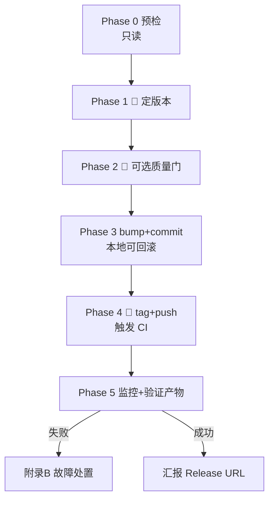

<!-- Last verified: 2026-07-02 -->

# 发布 Runbook（AI Agent 执行）

> **这是一份写给 AI Agent 的可执行剧本。** 用户 `@agent-release.md` 即表示「帮我发一个版本」。
> Agent **必须严格按下面的 Phase 顺序执行**，在标注 🙋 **ASK** 的地方停下用 `ask` 工具向用户提问、拿到决策再继续；
> 在标注 🛑 **CONFIRM** 的地方（不可逆的远程操作）必须先取得用户明确同意才执行。
>
> **背景（一次读懂）**：本项目发布链路是「打 `v*` tag → push → `.github/workflows/release.yml` 自动打包上传到 GitHub Release」。
> 矩阵只出 **mac arm64 + win x64**（无 linux、无 mac x64）。Release 正文由 workflow 的 `release-notes` job 自动生成。
> **Agent 本地不打包**——本地只做 版本 bump + commit + tag + push，其余交给 CI。

---

## ⚠️ Agent 纪律（务必遵守）

1. **git 授权范围**：本项目默认禁止擅自 git 操作。用户 `@agent-release.md` 即为对「本次发布所需的 git 操作」的明确授权——但**仅限本剧本列出的命令**，且 `git push`（Phase 4）必须先 🛑 CONFIRM。不得 `git push --force`、不得改历史、不得动其他分支。
2. **失败即停**：任何命令非 0 退出，**立即停止**，把 stderr 原文报给用户，不要猜着往下跑。
3. **不本地打包**：不要跑 `npm run dist*`。打包是 CI 的事，本地跑既慢又无意义。
4. **每个 Phase 结束**用一句话汇报「做了什么 / 下一步」。

---

## Phase 0 — 预检（只读，不改任何东西）

依次执行并核对，**任一不通过就停下问用户**：

1. **分支与工作区干净**
   ```bash
   git rev-parse --abbrev-ref HEAD   # 期望 main
   git status --porcelain            # 期望空输出（无未提交改动）
   ```
   - 不在 `main` → 🙋 **ASK**：「当前在 `<branch>`，是否切到 main 再发？还是就在此分支发？」
   - 工作区有未提交改动 → 🙋 **ASK**：「有未提交改动 `<列出>`，先提交/暂存后再发？」**不要擅自 commit 别人的改动。**

2. **远程正确**
   ```bash
   git remote get-url origin   # 期望 git@github.com:flowingfate/deskmate.git
   ```

3. **当前版本 & 已有 tag**
   ```bash
   node -p "require('./package.json').version"
   git tag --list 'v*' --sort=-v:refname | head -5
   ```
   记住当前版本，供 Phase 1 计算与去重（新版本不能撞已有 tag）。

4. **发布 workflow 存在**
   ```bash
   test -f .github/workflows/release.yml && echo OK
   ```
   不存在 → 停下告知用户「发布 workflow 缺失，需先补 `.github/workflows/release.yml`」。

5. **一次性前置提醒**（无法用工具核实，需用户口头确认）
   🙋 **ASK**：「确认过 GitHub 仓库 **Settings → Actions → General → Workflow permissions 已设为 “Read and write”** 吗？（否则 CI 无权创建 Release，job 会 403）」
   - 用户答「没设/不确定」→ 让其先去设，本次发布暂停。

---

## Phase 1 — 决定版本号 🙋 **ASK**

用 `ask` 工具，基于 Phase 0 拿到的当前版本 `<cur>` 提问：

> 「当前版本 `<cur>`。这次发什么版本？」
> - `patch`（<cur> → 修订号+1，bug 修复）
> - `minor`（<cur> → 次版本+1，新功能，**推荐默认**）
> - `major`（<cur> → 主版本+1，破坏性变更）
> - 指定具体版本号（如 `0.3.7`）

拿到选择后**先算出新版本号**并回显给用户核对：`<cur> → <new>`。
- 校验 `v<new>` 不在 Phase 0 列出的已有 tag 里；若撞了，停下问用户。

> 首次发布特别提示：若 Phase 0 显示**从无任何 `v*` tag**（历史首发），🙋 **ASK** 是否先做一次**预演**（见 Phase 5 附录 A），用 `v0.0.1-test` 验证整条链路绿灯后再发正式版。推荐首发务必预演。

---

## Phase 2 —（可选）本地质量门 🙋 **ASK**

CI 的 `release.yml` **只打包、不跑 typecheck/test**（那是 `ci.yml` 的职责，且只在 push 到 main / PR 时触发）。所以 tag 发布前没有自动质量门。

🙋 **ASK**：「发布前要不要本地跑一次 `npm run typecheck && npm test && npm run build` 把关？（约数分钟；跳过则直接发）」
- 用户选「跑」→ 依次执行，任一失败则停下报错，**不继续发布**。
- 用户选「跳过」→ 记录「用户选择跳过质量门」，继续。

> 注意 CLAUDE.md 提示这些命令别频繁跑；此处是发布关口，跑一次合理。

---

## Phase 3 — Bump 版本 + 提交（本地，可回滚）

1. **bump 版本号**（不打 git tag，只改 package.json + lock）
   ```bash
   npm version <patch|minor|major|X.Y.Z> --no-git-tag-version
   ```
   （旧的 `npm run prepare:release` 已废弃删除，直接用 `npm version`。）

2. **核对改动**
   ```bash
   git diff --stat            # 期望只有 package.json (+ package-lock.json)
   node -p "require('./package.json').version"   # 确认 = <new>
   ```

3. **提交**
   ```bash
   git add package.json package-lock.json
   git commit -m "release: v<new>"
   ```

此刻尚未 push，一切可 `git reset --hard HEAD~1` + 改回版本号回滚。

---

## Phase 4 — 打 tag 并推送 🛑 **CONFIRM**（不可逆，触发 CI 发布）

**push tag 会立即触发线上打包发布，是本流程唯一不可逆的一步。**

1. 打 tag（本地）
   ```bash
   git tag v<new>
   ```

2. 🛑 **CONFIRM**：向用户明确：
   > 「即将 `git push origin <branch> --tags`，这会推送 commit + tag `v<new>`，**立即触发 GitHub Actions 打包并创建正式 Release**。确认发布？」

   - 用户确认 → 执行：
     ```bash
     git push origin <branch> --tags
     ```
   - 用户改主意 → 停下。可回滚：`git tag -d v<new>` + Phase 3 的 reset。

---

## Phase 5 — 监控 CI 并验证产物

1. **盯 workflow 跑绿**（用 `gh` CLI，官方 runner 与本机若装了 gh 均可）
   ```bash
   gh run list --workflow=release.yml --limit 1
   gh run watch <run-id>      # 阻塞到结束；或给用户 Actions 页面 URL 让其自己看
   ```
   - 两个 matrix job（mac arm64 / win x64）+ `release-notes` job 全绿为成功。
   - 失败 → 见下方 **附录 B 故障处置**，按错误类型给用户具体建议，**不要盲目重推**。

2. **验证 Release 产物**
   ```bash
   gh release view v<new> --json assets,body -q '.assets[].name'
   ```
   核对：
   - [ ] mac arm64 安装包：`Deskmate-<new>-mac-arm64.dmg` + `.zip`
   - [ ] win x64 安装包：`Deskmate-<new>-win-x64.exe` + `.zip`
   - [ ] **无** `latest-mac.yml` / `latest.yml`（已 `publishAutoUpdate:false` 关闭，若出现说明配置回退了）
   - [ ] Release 正文（`body`）非空（`release-notes` job 已回填）

3. **汇报**：把 Release 页面 URL、asset 清单、版本号发给用户，宣告完成。

---

## 附录 A — 调试 / 预演（首发或大改前强烈建议）

### A.1 演练模式（dry-run）—— 零副作用，**首选**

不要私自 run 这个，可以询问用户是否预演过了，是否需要帮忙预演

workflow 支持手动触发的**演练模式**：完整跑打包，但**不发布到 Releases 页面**，产物改传 Actions Artifacts（临时、私有、7 天后自动过期）。用来验证「CI 里打包这条链通不通」，不打 tag、不浪费版本号、无需清理。

```bash
# 触发演练（publish 默认 never = 只打包不发布）
gh workflow run release.yml
# 或去 Actions 页面点 "Run workflow" 按钮，publish 选 never

gh run list --workflow=release.yml --limit 1   # 拿 <run-id>
gh run watch <run-id>                          # 等结束

# 失败 → 看日志定位（见附录 B）
gh run view <run-id> --log-failed

# 成功 → 下载产物自检（mac .dmg / win .exe 能不能装）
gh run download <run-id>
```

反复点、反复看，**Releases 页面一个字都不会写**。演练全绿后，再走 Phase 3/4 打正式 tag——此时心里有底，同样的打包流程刚绿过。

### A.2 预发 tag 预演 —— 端到端验证「真发布」链路

演练模式不覆盖「创建 Release + 上传 asset + 回填 notes」这最后一段（那需要真 tag）。若要连这段也验，用一次性 `-test` tag，验完清理：

```bash
# 不改 package.json 版本，直接在当前 commit 打预演 tag
git tag v0.0.1-test
git push origin v0.0.1-test        # 🛑 同样需 CONFIRM（会触发一次真实发布）
gh run watch <run-id>              # 等绿
gh release view v0.0.1-test        # 核对两平台 asset + body 回填

# 验证无误后清理（删远程 tag + Release）
gh release delete v0.0.1-test --yes --cleanup-tag
git tag -d v0.0.1-test
```

> **推荐顺序**：先 A.1 演练（快、零副作用）跑通打包 → 再 A.2 预发 tag 验一次完整发布 → 最后正式发。首发务必至少做 A.1。

---

## 附录 B — 故障处置速查

| 症状 | 原因 | 处置 |
|---|---|---|
| job 一开始就 **403 / Resource not accessible** | Workflow permissions 未设 Read and write | 让用户去 Settings→Actions 改，然后重跑该 run：`gh run rerun <id>` |
| **422 release already exists** / 两个包只上传了一个 | 并发 matrix 抢建同一 Release | 先 `gh run rerun --failed <id>` 重试失败 job；若反复撞车，回来改 workflow 为「draft 两阶段」（前置 job 建 draft → 矩阵传 asset → 末尾 un-draft） |
| **bun: command not found** | runner 未装 bun | 不应发生（workflow 已含 `oven-sh/setup-bun@v2`）；若真出现说明该步被删，补回 |
| **ripgrep / 原生模块 install 失败** | postinstall 拉预编译二进制被限流 | 确认 install 步骤带 `GITHUB_TOKEN`（已配）；重跑 |
| Release 正文为空 | `release-notes` job 失败或被跳过 | 手动补：`gh api -X POST repos/flowingfate/deskmate/releases/generate-notes -f tag_name=v<new> --jq .body` 取到内容后 `gh release edit v<new> --notes "<内容>"` |

---

## 完整流程速览（Agent 心智模型）



---

## 相关文件

- `.github/workflows/release.yml` — 被 tag 触发的实际发布 workflow
- `electron-builder.config.js` — 打包 / publish / 产物命名配置
- `scripts/vite/pack.ts` — CI 里 `--publish always` 调的打包入口
