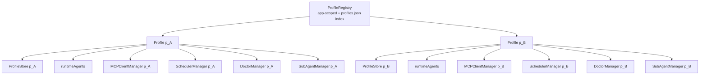

# 多 Profile 运行时架构迁移规划

<!-- Status: complete — Phase 7 profile ownership, routing, and verification complete -->
<!-- Last verified: 2026-07-18 -->

## 1. 目标

把主进程从“**只有 selected / active Profile 运行**”迁移为“**所有已存在 Profile 可在同一主进程中独立、并行运行**”。

这里的独立包含：

- 每个 Profile 的持久化数据、SQLite 连接、Agent / Session store 独立；
- 每个 Profile 的 Pi Agent 内存态、stream、subagent active run 独立；
- 每个 Profile 的 MCP client、连接锁、OAuth token cache、runtime state 独立；
- 每个 Profile 的 scheduler task、timer、cold-start catch-up、scheduler state 独立；
- 每个主 `BrowserWindow` 在创建时绑定一个 Profile；窗口存活期间其 Profile identity **不可变**；
- Profile 的切换形式是创建绑定目标 Profile 的新主窗口；用户可保留或关闭旧窗口；所谓“切换”也等价于“先打开新窗口，再关闭旧窗口”；
- 进程退出时，所有 Profile 都被有序停止、flush 并关闭。

`defaultProfileId` 只表示首次启动 / 无显式目标的新窗口默认候选；它是只读 bootstrap 结果，不表达任何已存在 renderer 的当前展示，也不能承担运行时资源选址或生命周期管理。

---

## 2. 现状与问题

### 2.1 名称占用了错误的抽象层级

当前：

| 路径 | 当前 class | 实际职责 |
|---|---|---|
| `src/main/persist/profile.ts` | `Profile` | 一个 profile 的持久化聚合：settings、auth、MCP/skills/models 配置、Agent store、session index、SQLite 生命周期 |
| `src/main/persist/profiles.ts` | `Profiles` | `profiles.json` 的索引、selected profile、创建/删除/切换、当前持久化 cache 生命周期 |

两者都只是 persist 层对象，不是将来应承载运行时服务的 `Profile`。

### 2.2 当前切换会停止旧 Profile

`Profiles.switch()` 当前会处理旧 Profile 的 MCP client 清理、store shutdown、SQLite close 和 cache evict，再加载新 Profile；scheduler 也只维护单个 active context。

这意味着当前“切换 Profile”实质上是“停止旧 runtime，再启动新 runtime”，无法满足并行运行。

### 2.3 主要全局状态依赖 active Profile

当前至少存在以下阻塞点：

| 模块 | 当前问题 | 多 Profile 后的要求 |
|---|---|---|
| `pi/agent.ts` | 模块级 `Map<agentId, Agent>`；创建 session 前校验 `activeProfileId` | Pi Agent cache 归属运行时 Profile |
| `pi/tools/subagent.ts` | 从 `Profiles.get().active()` 取 profile，并拒绝非 active 的 `ctx.profileId` | 从 `ctx.profileId` 精确找到 Profile runtime |
| `pi/session/regular.ts` | stop 时只会取消 active profile 的 subrun | 按 session 自己绑定的 Profile 取消 |
| `lib/mcpRuntime/` | client / lock / runtime state 的 key 都是 `serverName`，配置通过 active Profile 获取 | 一个 Profile 一个 MCP manager；所有状态带 profile identity |
| `DeskmateTokenCache` | 全局内存 cache，读写目录由运行时 `activeProfileId` 决定 | 一个 Profile 一个 credential cache，或明确注入 profile ID |
| `McpAuthService` | OAuth dedup / UI interaction 没有 profile identity | dedup key、prompt、状态事件必须包含 profile ID |
| `lib/scheduler/` | 一个 `SchedulerContext.profile`，切换会清理旧任务 | 每个 Profile 一个 SchedulerManager |
| persist/chat/MCP/schedule IPC | 大部分请求只带 agentId / sessionId / serverName | 所有 profile-scoped 操作可按 profileId 精确路由 |

### 2.4 草稿当前不能接入

`src/main/profile.ts` 的草稿表达了正确方向，但现有 API 尚未满足它：

- `SubAgentManager` 构造器是 private，唯一入口是 `SubAgentManager.forProfile(profileStore)`；
- `MCPClientManager` 和 `SchedulerManager` 当前构造器不接受 Profile；
- 两个 manager 内部仍依赖 active Profile；
- 草稿的静态 `Map` 没有并发初始化合并，也没有 start / dispose 生命周期。

---

## 3. 目标架构

### 3.1 命名

```text
src/main/
├── profile.ts                  Profile
├── profileRegistry.ts          ProfileRegistry（含 profiles.json index）
└── persist/
    └── profileStore.ts         ProfileStore
```

| 名称 | 责任 |
|---|---|
| `ProfileStore` | 单个 profile 的磁盘数据与持久化领域对象；不拥有 Pi/MCP/Scheduler runtime |
| `Profile` | 单个 profile 的运行时聚合根；拥有该 profile 的 store 与运行时服务 |
| `ProfileRegistry` | 进程级 registry；拥有 `profiles.json` index、Profile 创建、并发 load 去重、启动、停止与按 ID 查询 |

不使用 `ProfilePersist`：`ProfileStore` 的语义更准确，且避免在每个 import 处使用反向 alias。

### 3.2 组合关系



### 3.3 `Profile` 的职责

`Profile` 负责一个 profile 的运行时所有权与生命周期。建议的形态：

```ts
export class Profile {
  readonly id: string;
  readonly store: ProfileStore;
  readonly doctor: DoctorManager;
  readonly mcpManager: MCPClientManager;
  readonly scheduler: SchedulerManager;

  private readonly agents = new Map<string, Agent>();

  start(): Promise<{ warnings: string[] }>;
  dispose(): Promise<void>;
  getOrCreateAgent(agentId: string): Agent;
  getAgent(agentId: string): Agent | undefined;
  getSubAgentManager(): SubAgentManager;
}
```

约束：

1. `ProfileStore` 继续拥有持久化 Agent / Session / Schedule 的对象图。
2. `runtimeAgents` 只保存 Pi Agent 和内存中的 Pi Session；不得与 store 的 Agent cache 混用。
3. 不允许业务路径先读 selected Profile，再根据裸 `agentId` / `serverName` 猜所属 Profile。
4. Profile 一旦进入 stopping 状态，拒绝新的工作；已经开始的工作按明确策略完成、取消或 flush。

### 3.4 `ProfileRegistry` 的职责

`ProfileRegistry` 是唯一 app-scoped singleton；它不是某个 Profile 的 runtime owner。

建议持有：

```ts
private readonly profiles = new Map<string, Profile>();
private readonly loading = new Map<string, Promise<Profile>>();
private items: ProfileIndexEntry[] = [];
private defaultProfileId = '';
```

必须满足：

- `getOrLoad(id)` 合并相同 profile 的并发初始化；
- `bootstrap()` 自己加载 `profiles.json` index，再加载并启动所有 entry 对应的 runtime Profile；
- `defaultProfileId` 仅返回 `profiles.json` 的启动 / 新窗口默认候选；
- 不提供 `selected()` / `selectedStore()` / `selectedStoreSync()` / `select()`；打开 Profile 必须创建新主窗口并在窗口创建时绑定 ID；
- `shutdownAll()` 等待所有 Profile 完成 stop / flush；
- 删除 Profile 前必须先停止其 runtime，并处理正在执行的 stream、subrun、scheduler run 与 MCP connection。
- Profile 管理 UI 可以编辑 index `displayName`，但不得改变 window owner ID；删除只允许非 sender current、无 owner main window、且不是最后一个的 Profile。main 必须在执行时重新校验并将 target 标为 stopping/removing，避免 open 与 delete 竞态。

### 3.5 Profile owning main window

每个 runtime `Profile` 持有至多一个 nullable `mainWindow: BrowserWindow | null`。`MainWindowManager.open(profileId)` 在创建窗口后立即调用 `profile.attachMainWindow(window)`；同 Profile 已有窗口时聚焦它，不重复创建。窗口真正销毁时若仍是该 Profile 的当前 window 则 detach。macOS 上仅**最后一个**主窗口的 close 会被拦截并 hide 以保持应用驻留；同时存在其他主窗口时，close 必须真实销毁目标 Profile 窗口，使其可进入关闭后删除流程。Profile 没有窗口时 scheduler、MCP 与已启动工作继续运行，但不能向 renderer 发 UI event；状态留在 runtime/persist，等待下次打开该 Profile 窗口再 hydrate。Doctor task 是显式例外：它可能等待用户问答，owner window 真正销毁时必须 abort，禁止带着空答案继续创建 Issue 或向其他 Profile 窗口 fallback。

Profile-scoped main → renderer event 必须先由 owning Profile 找到 window，再只发送到该 webContents。发送给 owner window 的 IPC payload **不得包含 `profileId`**：renderer 已有不可变 `electronAPI.profile.id`。只有天然跨 Profile 的产品操作才显式携带 target Profile ID。

### 3.5 应用级资源与 Profile 级资源

| 资源 | 所属层 | 规则 |
|---|---|---|
| `ProfileStore`、ProfileDb、persist Agent | Profile | 每 profile 独立 |
| Pi Agent / Pi RegularSession runtime | Profile | `runtimeAgents` 私有持有 |
| SubAgentManager | Profile | 复用或改造 `forProfile(profileStore)` 语义 |
| MCP clients / locks / status / OAuth cache | Profile | 不可按裸 serverName 跨 profile 共享 |
| Scheduler tasks / timers / catch-up | Profile | 一个 Profile 一个 scheduler |
| Doctor task / question resolver / abort controller | Profile | 一个 Profile 一个 `DoctorManager`；每次最多一个 task，owner window 关闭或 Profile stop 时取消 |
| Background process session | Profile | 在对外暴露前必须明确 owner；不能继续仅靠全局随机 session ID |
| TerminalManager | 应用 | 共享 OS 进程池；Profile service 只持有自己的 terminal handles |
| RuntimeManager、Bun/uv 安装 | 应用 | `{userData}/env` 是设备级运行时 |
| Playwright 安装、Electron window、日志、feature flags | 应用 | 进程 / 设备级资源 |
| OAuth callback server port | 应用 | 端口可共享，但 OAuth request / token / prompt 需 profile-scoped |

全局资源配额可以存在，但不得把 Profile 状态重新收敛为单例。例如所有 scheduler 可以共享一个 application-level semaphore 来限制真正的 LLM 执行总并发；每个 scheduler 的任务登记、状态机和 timer 仍归自身 Profile。

---

## 4. 核心不变量

1. **运行中的工作绑定启动时的 Profile。** Chat、subrun、MCP call、schedule run 一旦启动，后续不得重新读取任何 UI 默认 Profile。
2. **任何 profile-scoped key 都包含 profile identity。** 不能只用 `serverName`、`agentId`、`sessionId`、`subrunId` 作为跨 Profile runtime map key。
3. **主窗口 Profile 不可变。** `BrowserWindow` 在构造时以 `webPreferences.additionalArguments` 注入 Profile ID；preload 从 `process.argv` 同步读取，`contextBridge` 将其作为冻结的 `window.electronAPI.profile.id: string` 暴露。不得发送 `profile:switched` 来改变既有窗口的 owner。
4. **多主窗口并存。** 打开不同 Profile 必须新建窗口；关闭一个窗口不影响其 Profile 的后台 scheduler、MCP、chat 或 delegated execution。
5. **所有 profile-scoped IPC 可精确路由。** 新操作由窗口的不可变 `profileId` 传入；已运行操作通过启动时绑定的 runtime Profile 操作。
6. **Main → owner window 的 runtime event 由 main 精确选址。** payload 可保留 profile identity 作诊断或 runtime correlation，但 renderer 不得用它做 window/Profile filter。
7. **MCP OAuth 隔离。** token file、inflight dedup key、consent request、runtime state、server connection 都必须按 Profile 分开；没有 owning window 的 Profile 不得向任意其它窗口误发 prompt。
8. **关闭顺序正确。** 先阻止新增工作，再停止 scheduler / cancel runtime work / 关闭 MCP / flush persist / close SQLite。
9. **持久化源真值不变。** 本次迁移只移动内存 owner 与命名；`AGENT.md`、`data.json`、`messages.jsonl`、`jobs.json`、SQLite rebuild 不变量不改变。

---

## 5. 迁移阶段

每一阶段都应保持可编译、可测试、可回滚；不要在一个提交中同时改命名、IPC 契约、MCP OAuth 和 scheduler 行为。

### Phase 1：持久化层改名，不改行为

**目标：** 释放 `Profile` 名称，建立准确的 persist 边界。

1. `src/main/persist/profile.ts` 改为 `profileStore.ts`，class `Profile` 改为 `ProfileStore`。
2. `src/main/persist/profiles.ts` 的 `profiles.json` index 职责收口到 `ProfileRegistry`，不保留独立 persist index class。
3. 更新 persist barrel export、所有 import、测试 fixture 与深层 import。
4. 保留现有 bootstrap、active、switch 行为，暂不改变 runtime 生命周期。
5. 更新 `src/main/persist/ai.prompt.md`、`ai.prompt/persist.md` 的文件表和组合关系。

**验证：**

- 使用 LSP `rename` / `rename_file` 迁移 exported symbol 与文件引用；禁止文本替换跨文件改名。
- 运行 persist 相关现有测试。
- `npm run typecheck` 与 `npm run build`。

### Phase 2：建立运行时 `Profile` 与 `ProfileRegistry`

**目标：** 创建运行时所有权模型，但先不迁移 MCP / scheduler 的实际服务。

1. 新增 `src/main/profile.ts`，持有 `ProfileStore` 和私有 `runtimeAgents`。
2. 新增 `src/main/profileRegistry.ts`，持有 `profiles.json` index、已加载 runtime map 与 loading promise map。
3. 把 ProfileStore 的静态 cache / evict 语义迁移到 runtime registry；store 本身不再兼任全进程 runtime registry。
4. `ProfileRegistry` 统一管理 index 与启动默认候选；最终 API 命名为只读 `defaultProfileId`。
5. 把新的 `ProfileRegistry` 作为 startup、IPC 与退出路径的唯一入口。
6. 最终删除所有 ambient selection accessor；业务路径必须持有 `Profile` 或显式用 ID 调 `require()` / `getOrLoad()`。

**验证：**

- 同时请求两次 `getOrLoad(profileId)`，只产生一个 runtime Profile。
- 创建两个 Profile 后切换 UI selection，两个 `ProfileStore` 仍在 registry 中。
- 删除 Profile 前其 runtime 会先进入 dispose。

### Phase 3：迁移 Pi Agent 与 subagent runtime

**目标：** 让用户 chat 与 delegated run 不再依赖 active Profile。

1. 删除 `pi/agent.ts` 的模块级 `Map<agentId, Agent>`。
2. 将 Pi Agent 创建、获取、移除收口到 `Profile.getOrCreateAgent()` / `Profile.getAgent()`。
3. Chat IPC 在入口解析 runtime Profile；Pi Session 从创建时起持有其 owning Profile 或窄服务接口。
4. `RegularSession.stopStream()` 不再通过 active Profile 寻找 subagent manager。
5. `pi/tools/subagent.ts` 用 `ctx.profileId → ProfileRegistry.require()`，不再比较 active profile。
6. 保留 `SubAgentManager.forProfile(profileStore)` 时，Profile 仅把它作为本 Profile 的 runtime service 暴露；如后续需要更完整生命周期，再迁移其 owner 类型。

**验证：**

- Profile A stream 期间切换到 Profile B，A 的 stream 能自然完成。
- 切换后仍可取消 A 的 stream 与 A 的 subrun。
- A 与 B 可同时执行独立 subrun；active state / IPC correlation 不串号。

### Phase 4：MCP 完整 Profile 化

**目标：** 消除 MCP 对 active Profile 的全部依赖。

1. `MCPClientManager` 构造时注入 ProfileStore 的 MCP config、Profile credential store 和 `profileId`。
2. 移除 `activeMcp()` / `patchServerConfig()` 这种全局 active lookup；manager 直接读写自己的 config store。
3. `RuntimeStateStore` 变为 profile-aware；IPC payload 改为 `{ profileId, states }`。
4. OAuth token cache 改为 instance / injected storage；不再通过 `activeProfileId` 决定文件路径。
5. OAuth inflight key 至少由 `profileId + serverKey` 组成。
6. OAuth consent、clientId prompt 与 interaction event 均包含 profile ID。
7. `pi/tool.ts` 的 MCP catalog 和 MCP execute 必须使用 session owning Profile 的 manager；不得再 import 全局 `mcpClientManager`。
8. 所有 appcmd MCP、MCP IPC、renderer state cache 改为由 Profile runtime 选址。

**验证：**

- 两个 profile 配置同名 server；连接、断开、lock、状态互不影响。
- 两个 profile 配置相同 OAuth server；token 文件与 inflight flow 不串号。
- Profile A 的 server state event 不影响正在查看 Profile B 的 MCP 页面。
- Profile A 的 Agent 只能看到并调用 A 的 MCP tools。

### Phase 5：Scheduler Profile 化

**目标：** 所有 profile 的定时任务并行登记、独立恢复。

1. `SchedulerManager` 构造时绑定一个 ProfileStore，移除单一 `SchedulerContext.profile` 的切换语义。
2. 删除或重定义 `SchedulerManager.switch()`；不再因 UI selection 改变而清理任务。
3. `Profile.start()` 初始化本 Profile scheduler；`Profile.dispose()` 停止本 Profile scheduler。
4. startup 后为全部 existing Profile 调用 runtime start。
5. power resume 向全部 started Profile 的 scheduler 分发。
6. 若需限制全局资源，注入 application-level execution limiter；不要使用单一 scheduler context 作为替代。
7. `scheduler-state.json#isActive` 的语义改为 runtime started，而不是 renderer selected。

**验证：**

- 两个 Profile 各有 cron / once task，切换 UI 后两者仍登记。
- 冷启动与 resume 各 Profile 独立执行 catch-up。
- 一个 Profile 的 scheduler failure 不阻止其他 Profile 初始化。

### Phase 6：核心 runtime 路由、事件隔离与退出收口（完成）

**目标：** 先消除会让后台 Profile 工作串号或被 selection 中断的核心运行时路径。

已完成：

1. Scheduler、MCP 与 Doctor 均由 runtime `Profile` 持有；旧全局 singleton / selection switch lifecycle 已删除。
2. 主进程退出与 updater handoff 统一走 `ProfileRegistry.shutdownAll()`；Profile 负责 scheduler → Doctor → Pi → MCP → persist/SQLite 的有序关闭。
3. Scheduler、chat、LLM、internal URL、attachment、Pi auth IPC 在 renderer 侧绑定当前 profile，并在 main 侧按 `ProfileRegistry.require(profileId)` 路由。
4. chat streaming、Pi auth 与 persist runtime event 的发送端均按 owner window 路由；renderer 不再按 payload `profileId` 二次过滤。

未覆盖的持久化/skill IPC、selection 依赖清理与完整 smoke test 移入 Phase 7，避免把已验证的核心 runtime 变更和大范围契约迁移混成不可审查的一批。

### Phase 7：Profile IPC 收口、业务路径清理与端到端验证

**目标：** 完成多主窗口的不可变 Profile ownership，收口剩余 profile-scoped IPC，消除业务路径对 selection 的运行时依赖，并以双窗口 / 双 Profile 场景验证完整隔离。
已完成：多主窗口 owner map / preload capability / sender-bound window、skill、filesystem、workspace、Doctor IPC 已落地；Doctor task、问答 resolver 与 abort controller 现按 Profile 绑定，owner window 关闭或 Profile 停止会取消对应 task；persist、MCP、subagent runtime event 已按 owner window 发送；media:// 与 eval runtime 不再反查默认 Profile。MCP OAuth response 绑定 owner Profile；AppCommand 的 Agent / Skill / Web 路径直接使用 `AppCmdContext.profile`，Registry 与 Store 层 ambient selection API 已删除。

1. 建立 application-level `MainWindowManager`：按 window ID 管理多个主窗口；创建 API 必须接收 `profileId`，把它写入 `BrowserWindowMeta` 与 `webPreferences.additionalArguments`。原 `mainWindow()` 单例 API 按调用语义迁移为 sender-owned window、focused window 或 profile-owner window，禁止静默选取任意窗口。
2. preload 从 `process.argv` 解析不可变 Profile ID，并以冻结的 `window.electronAPI.profile.id: string` 直接暴露；删除同步 owner IPC、动态 profile bridge 和 `persist:profile:switched` renderer 重 hydrate 模型。URL query 可行但不采用：`additionalArguments` 不污染路由，且同样在文档代码前可同步取得。
3. 对于由主窗口 renderer 发起的 profile-scoped IPC，renderer **不得传 `profileId`**。main handler 必须以 `IpcMainInvokeEvent.sender → BrowserWindow → BrowserWindowMeta.profileId → ProfileRegistry.require()` 解析 owner；这既删掉所有 facade 注入样板，也禁止 renderer 伪造目标 Profile。只允许“打开指定 Profile 新窗口”、profile index 管理等天然跨 Profile 的产品操作显式传 ID。
4. `skill` 及辅助 IPC（包括 profile-bound 文件、URL 与 LLM 入口）按同一 sender routing 规则迁移；main 内部 background / Tool 路径继续使用启动时持有的 `profileId`，不得伪装成 renderer IPC。
5. 审计并删除 `selected()` / `selectedStore()` / `selectedStoreSync()` / `select()`；`defaultProfileId` 仅允许首次启动、无显式目标的新窗口和 headless eval 使用，已启动业务必须持有 owner Profile。
6. 审计 main → renderer runtime event：发送端必须按 BrowserWindow owner 路由；Persist / MCP / subagent / scheduler / chat / Pi auth 的 renderer 订阅不再做 Profile filter。
7. 将 `Profile.mainWindow` 作为唯一 main → renderer 选址入口：persist/chat/Pi/MCP/subagent/scheduler event 先按 Profile 找 window，再发 owner payload。MCP OAuth 等无 owner window 的 UI interaction 明确进入等待/取消策略，禁止 fallback 到另一个 Profile 的窗口。
8. 更新 `arch-main.md`、`arch-render.md`、`persist.md`、MCP / scheduler / pi / subagent / IPC 模块文档及 `Last verified` 日期。

**验证：**

- 两个 Profile 分别在两个主窗口并行执行 chat、subrun、MCP 与 schedule；关闭其中一个窗口不停止或串写任一 Profile 的后台工作。
- 从 Profile A 打开 Profile B 必须创建绑定 B 的新窗口；A 窗口的 `electronAPI.profile.id` 在整个生命周期内不变。
- 两个 Profile 使用同名 MCP server、同名 Agent 展示名及不同 session/subrun ID 时，所有 request / event 精确落在 owner window 与 Profile。
- 两个 Profile 可并行运行各自的 Doctor task；关闭其中一个 Doctor owner window 或停止该 Profile 必须取消仅该 task，另一个 Profile 不受影响。
- 退出后所有 Profile 完成 scheduler 停止、Pi session 收尾、MCP child process cleanup、JSONL flush 与 SQLite close。
- 按用户约束，单元测试统一留待全量重构完成后处理；构建阻塞需区分本阶段错误与既有 `mcpClient.ts` 语法错误。

**Phase 7 验证记录（2026-07-17）：** 使用 `DESKMATE_TEST_USER_DATA_PATH=/tmp/deskmate-phase7-dual` 启动隔离 Electron 实例，seed 两个 guest Profile。Profile A 通过 `window:openProfile(profileBId)` 打开 B 后，CDP 观测到两个 renderer 分别暴露 A/B 的不可变 `electronAPI.profile.id`；A 的 identity 保持不变；关闭 A 后 B 仍可成功调用 `mcp:getServerStatus`。`npm run typecheck` 与 `npm run build` 均通过。单元测试按用户约束留待全量重构完成后统一处理。

---

## 6. IPC 迁移原则

### Renderer → Main

主窗口 renderer 发起的 profile-scoped IPC 不传 `profileId`：

```text
IpcMainInvokeEvent.sender
  → BrowserWindow.fromWebContents(sender)
  → BrowserWindowMeta.profileId
  → ProfileRegistry.require(profileId)
```

这样 renderer 不需要 facade 注入样板，且无法请求另一个窗口的 Profile。只允许“打开指定 Profile 新窗口”等天然跨 Profile 操作显式携带 ID。handler 不得读取 `defaultProfileId`；它只服务启动默认选址。

主窗口 renderer 的 Profile 由 main 在 `BrowserWindow` 构造时注入 `webPreferences.additionalArguments`，preload 从 `process.argv` 同步读取。它是 immutable window identity，不是可切换状态：`window.electronAPI.profile.id` 可以是冻结的 string，既无 IPC 传输，也无 event 时序、snapshot 或 reload 竞态。URL query 不采用，因为会混入 renderer 路由；只有窗口创建时的启动参数才是合适的 capability injection。

### Main → Renderer

runtime event 只发送到 owning Profile 的主窗口，payload 不重复携带 `profileId`：

```text
Profile.mainWindow
  → owner WebContents
  → renderer（其 window.electronAPI.profile.id 不可变）
```

发送端以 Profile identity 选址；renderer 不做 Profile filter。

### Tool execution

`ToolContext.profile` 是 tool 执行的运行时 service 事实来源：

```text
ToolContext.profile
  → owning runtime Profile
  → MCP / subagent / background-process service
```

`ToolContext.profileId` 可继续用于 trace、URI 和只接收 ID 的下游 API，但不得在工具执行链中反查 registry 取得 service。

禁止 LocalTool、MCP wrapper 或 appcmd kernel 反向读取 selected / active Profile。

---

## 7. 风险与取舍

### 风险：一次性启动所有 Profile 会扩大资源使用

MCP auto-connect、scheduler catch-up、cron watchdog 都可能在 startup 同时启动。

**决策：** runtime state 与 ownership 必须全 Profile 并行；网络、LLM、child-process 等昂贵操作可通过进程级受限并发器限流。不能用“只运行 selected Profile”作为资源控制手段。

### 风险：Profile 删除与正在运行的任务冲突

**决策：** 删除流程必须进入明确 stopping 状态，停止 timer、拒绝新工作、取消或等待已有工作、flush persist、关闭 DB，最后才移除 registry entry 和磁盘数据。

### 风险：MCP OAuth UI 只有一个 renderer 主窗口

**决策：** UI 可以只显示当前窗口，但 prompt 的 requestId 与 payload 必须带 profileId。若 Profile A 的 background MCP connection 触发 OAuth，而当前正在看 B，renderer 必须能正确显示“这是 A 的授权请求”，不能把 token 写到 B。

### 风险：内部 URL 与媒体协议仍按 active Profile 解析

**决策：** internal URL 已具备 `ResolveContext.profileId` 时必须按该 ID 直接访问对应 ProfileStore；只在 URI 本身不带 profile identity 且产品明确限定“当前 UI profile”的入口，才允许取 selected Profile。

---

## 8. 完成标准

迁移完成必须同时满足：

1. `Profile` 只表示 runtime Profile；persist 类不再占用该名称。
2. `ProfileRegistry` 统一拥有 `profiles.json` index，不再由独立 store 关闭、evict 或重启 runtime Profile。
3. 每个 existing profile 在主进程中拥有独立运行时实例与生命周期。
4. UI selection 切换不会影响其他 Profile 的工作。
5. MCP、OAuth、scheduler、Pi Agent、subagent 的所有内存状态可按 profile identity 隔离。
6. 所有 profile-scoped IPC 和 runtime event 都有明确 profile routing。
7. 进程退出等待所有 Profile 完成必要的 stop / flush / close。
8. 已修改模块的 `ai.prompt.md`、全局架构文档、测试均同步更新。
