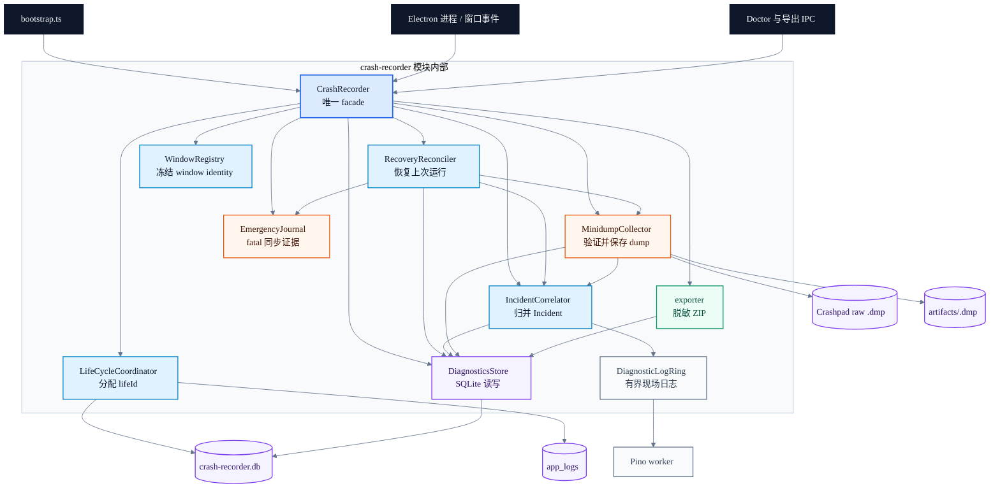
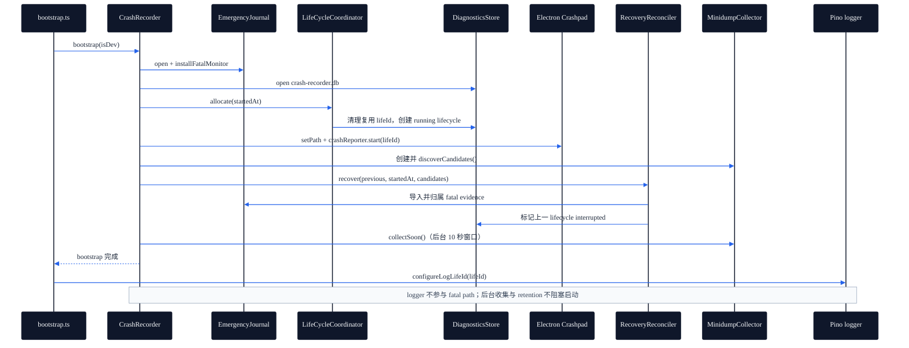
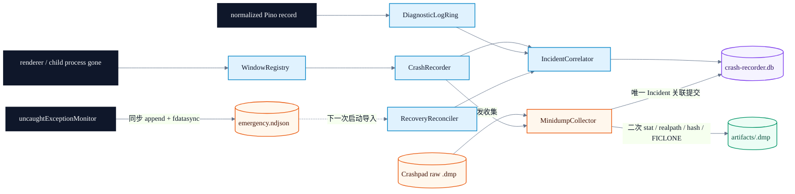
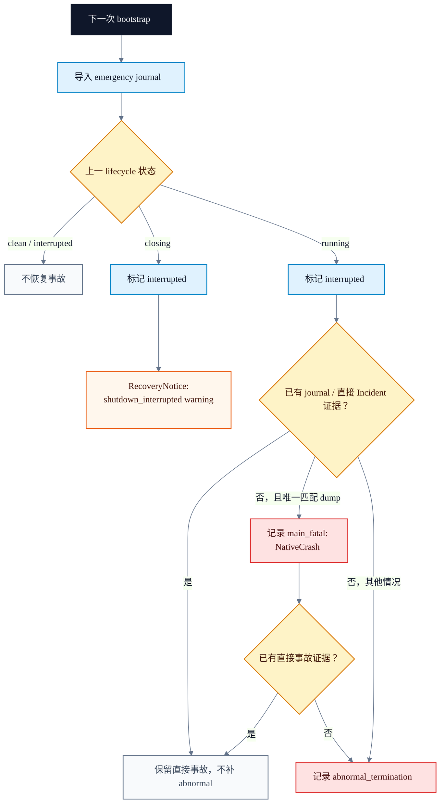

<!-- Last verified: 2026-07-21 -->
# Crash Recorder（`src/main/lib/crash-recorder/`）

> Main-only 的低频崩溃诊断系统。以 `lifeId` 和因果 `Incident` 为核心；普通 JavaScript 错误仍只进入结构化日志。

## 关键文件

| 文件 | 职责 | 规模 |
|---|---|---:|
| `CrashRecorder.ts` | fail-closed facade；最早启动、Crashpad、Electron 事件、退出编排 | ~310 |
| `RecoveryReconciler.ts` | 导入 emergency journal、归属上次 lifecycle、恢复异常退出 | ~100 |
| `DiagnosticsStore.ts` | 独立 `crash-recorder.db`；`lifecycles` / `incidents` 两张表、查询、retention | ~365 |
| `LifeCycleCoordinator.ts` | 从 Recorder DB + 日志 DB 统一分配 `[1,200000]` lifeId，并清理复用槽 | ~110 |
| `IncidentCorrelator.ts` | life-scoped 3 秒因果合并、10 秒现场窗口、单调根因提升、事务结果传播 | ~330 |
| `EmergencyJournal.ts` | 预打开同步 fatal journal；不依赖 Promise、logger 或 SQLite | ~135 |
| `DiagnosticLogRing.ts` | logger 前置同步 sink；512 条 / 512 KiB 双上限；snapshot 再按 DB 字节预算裁剪 | ~145 |
| `MinidumpCollector.ts` | 10 秒稳定重扫、仅为已关联 Incident hash/reflink、未关联 dump 留在 raw queue | ~300 |
| `WindowRegistry.ts` | BrowserWindow / WebContentsView 的 immutable owner、崩溃前 identity snapshot 与 expected termination | ~125 |
| `exporter.ts` | 单 Incident 字段级 ID/URL 脱敏 ZIP；minidump 显式确认 | ~180 |
| `types.ts` | lifecycle / Incident / event / snapshot discriminated unions | ~219 |
| `__tests__/` | 真 SQLite、journal、关联、minidump、隐私导出测试 | — |
| `__fixtures__/electron-main.ts` | 真实 Electron `process.crash()` / 双 Profile / 正常退出 fixture | — |

## 架构

### 模块边界与依赖

边的方向表示运行时调用或数据依赖；`CrashRecorder` 是唯一允许被业务代码直接使用的入口，其余节点不得通过 barrel 绕过 facade 构造。

配色表达职责而非装饰：深蓝为外部入口，蓝色为编排与归并，橙色为崩溃证据，紫色为持久化，绿色为受控输出，灰色为观测链路。

### 启动顺序

`bootstrap.ts` 设置业务根和 Chromium `userData` 后、动态加载 `main.js` 前调用 `crashRecorder.bootstrap()`：

1. 创建 `diagnostics/{dev,prod}`，预打开 `emergency.ndjson`，安装 `uncaughtExceptionMonitor`。
2. 打开独立 Recorder DB；从 Recorder / 日志 DB 中按时间选择最新 life，分配统一 lifeId。
3. 清理即将复用的 lifecycle、Incident 和 `app_logs` 槽；bootstrap 将同一 lifeId 显式配置给 logger，随后 Pino worker 仅消费该 option。
4. `crashReporter.start(globalExtra.life_id)`；Crashpad root 固定在同一 diagnostics mode 目录。
5. `RecoveryReconciler` 导入 journal、发现 dump 候选并归属上次 lifecycle；将上次 `running|closing` lifecycle 恢复为事故或中断通知。
6. 后台在 10 秒有界窗口内重扫并稳定化 dump、串行 hash/copy/关联；retention 与 raw/artifact cleanup 均不阻塞启动；之后才加载主进程业务图并创建 renderer。

`globalThis.__deskmateCrashRecorder` 保证 bootstrap/main 两个独立 bundle 共享同一 facade 实例。

### 三层持久化

Recorder 内部错误只走限频 `safeStderr()`；禁止反调 logger，避免递归。

### 公共 API

`index.ts` 只导出进程级 `crashRecorder` facade 和 Doctor 查询需要的 `IncidentKind`。Store、Journal、Correlator、Collector、Ring、WindowRegistry 与 exporter 都是模块内部实现；生产调用不得通过 barrel 直接构造或绕过 facade。

### Incident 语义

- `clean-exit` 永远忽略。
- shutdown/window expected termination 期间的 `killed` 永远忽略。
- renderer `crashed|oom|launch-failed|integrity-failure|abnormal-exit|unexpected killed` → `renderer_crash`。
- `memory-eviction` → `resource_eviction`。
- child fatal reason 立即记录；孤立 `killed` 只有同 service 60 秒内第 3 次才升级。
- 同一 life + fingerprint 10 秒内才累加 `occurrenceCount`；3 秒窗口只允许同一 renderer 或 child supporting signal 并入，独立 renderer root event 必须各自建 Incident；根因只能单调提升。
- 上次 `running` 且无 journal/dump/直接事故证据 → `abnormal_termination`；上次 `closing` 只输出 `shutdown_interrupted` warning，不创建 crash Incident。
- DB degraded 时 journal 使用 `lifeId=0`；恢复后优先校验原/上一 lifecycle 的时间范围，否则归入当前恢复 lifecycle，确保证据不会因保留值被丢弃。

恢复先导入 journal，再判断上一 lifecycle；这样 `lifeId=0` 的降级记录也能在存储恢复后归属到有效的 Incident。

### 容量和隐私

- Incident ≤100、90 天（至少保留最近 10）；lifecycle ≤1000。
- event ≤64；Incident logs ≤200 条且序列化后 ≤512 KiB；Ring 已淘汰或 snapshot 超预算都会标记 truncated；artifact metadata ≤3。
- journal ≤1 MiB；单条 ≤64 KiB；dump ≤256 MiB；diagnostics mode 总量 ≤512 MiB。
- 只接受两次 stat 稳定、第二次 lstat/realpath 仍位于 Crashpad root 内的普通 `.dmp`；拒绝 symlink、非 dump 和增长中文件。
- Collector 在复制前解析唯一 Incident ID；多个候选或无候选时只保留 Crashpad raw queue，不复制、不猜测归属。关联写入失败必须删除本次新建 artifact，且只有 Incident 事务提交后才删除原文件。
- Doctor 只读语义字段和 artifact metadata；event、日志消息、异常栈与 route 在返回前字段级脱敏，永不返回绝对路径或 dump bytes。
- renderer About 页单选一个 Incident 导出；默认不含 dump，勾选后必须先确认敏感内存风险。

## 常见变更

| 场景 | 修改文件 | 必须保持 |
|---|---|---|
| 新增 Incident kind/event | `types.ts` + `IncidentCorrelator.ts` + Doctor schemas + 导出 UI | discriminated union；同步 priority/fingerprint/summary |
| 改 lifecycle 分配 | `LifeCycleCoordinator.ts` + `sqlite-transport.cjs` + tests | 两个 DB 只分配一次；按时间而非 lifeId 排最近 |
| 改上次运行恢复 | `RecoveryReconciler.ts` + `CrashRecorder.ts` + recovery/smoke tests | journal 先于 lifecycle 归属导入；`closing` 只能产出中断通知，不能创建 crash Incident |
| 改窗口类型 | `WindowRegistry.ts` + `startup/wins.ts` + 直接创建 `BrowserWindow` / `WebContentsView` 的模块 | handler 持有崩溃前 identity snapshot；所有 renderer 都必须注册；禁止“最后窗口” |
| 改日志现场 | `DiagnosticLogRing.ts` + `IncidentCorrelator.ts` + `main/log/index.ts` | 同步、有界、条数与序列化字节双预算；fatal 不遍历任意对象 |
| 改 dump 规则 | `MinidumpCollector.ts` + evidence tests | 10 秒重扫、唯一 Incident ID 在 copy 前固定、二次 realpath containment、FICLONE、目标 hash 复验、事务提交后 unlink |
| 改 Doctor 查询 | `doctor/tools/listCrashIncidents.ts` / `readCrashIncident.ts` + `agentConfig.ts` | list 一次；detail 按相关性；字段级脱敏后再返回，不泄漏路径/二进制 |
| 改导出 | `exporter.ts` + `CrashIncidentExportCard.tsx` + app IPC | 单 Incident；Profile/Agent/Session ID 与 URL route 字段级脱敏；dump 与 >100 MiB 分别确认 |

## 注意事项

- `CrashRecorder.bootstrap()` 不得移回 `main.ts`；任何 main import 的顶层 `log.child()` 都可能先初始化 Pino。
- `beginShutdown()` 必须在窗口和后台服务开始关闭之前同步调用；`finishShutdown()` 在 logger close 后、`app.exit()` 前提交 `clean`。
- `uncaughtExceptionMonitor` 只同步 journal；不要在 handler 中加 `await`、Promise、SQLite、logger、扫描或复制。
- `RecoveryReconciler` 是上次运行恢复的唯一入口；不要把 journal 归属或 interrupted lifecycle 推断重新塞回 `CrashRecorder`。
- `IncidentCorrelator` 创建 open Incident 时必须先成功落库；同 life 内仅合并同 fingerprint、同 renderer 或 child supporting signal，root priority 单调提升；10 秒 timer 只补 post-crash logs/dump 并 finalize。
- `MinidumpCollector` process-gone 后在 10 秒内重复扫描；单次 growing stat 不是失败。只有存在唯一 Incident relation 才复制 dump；无法关联的 raw 保留，DB relation 提交前禁止 unlink。
- lifeId 会回环；所有“最近”查询按时间排序。复用前必须先删 Recorder 与日志 DB 中目标 ID。
- 旧 `~/.deskmate/crashes/` 和 `state/current-run.json` 不读、不迁移、不删除。

## 验证

- 单元/集成：`npm test`（必须经 Electron Node ABI）。
- 真实 Electron：`npm run test:crash-recorder-smoke`。
- smoke fixture 覆盖正常退出、updater、单 Profile 关闭、renderer crash、双 Profile 归属、main native/JS fatal、SIGKILL 和 closing 中断。

## 相关文件

- [`src/main/bootstrap.ts`](../../bootstrap.ts) — 最早初始化入口。
- [`src/main/main.ts`](../../main.ts) — 正常退出编排。
- [`src/main/log/ai.prompt.md`](../../log/ai.prompt.md) — Ring + Pino 双 sink 和 lifeId 传递。
- [`src/main/startup/wins.ts`](../../startup/wins.ts) — 所有产品 BrowserWindow 的注册入口。
- [`src/shared/ipc/ai.prompt.md`](../../../shared/ipc/ai.prompt.md) — renderer 定向导出 IPC；无 crash status/breadcrumb IPC。
- [`ai.prompt/data-flow.md`](../../../../ai.prompt/data-flow.md) — 日志与诊断数据流。

## 协变映射

| 修改 | 同步检查 |
|---|---|
| `types.ts` 的跨 UI 摘要字段 | `shared/ipc/app.ts` + `startup/ipc/app.ts` + `CrashIncidentExportCard.tsx` |
| lifeId 公式/范围 | `LifeCycleCoordinator.ts` + `sqlite-transport.cjs` + Log Viewer 最近 life 排序语义 |
| shutdown reason/入口 | `main.ts` + `menu.ts` + `autoUpdate/updateManager.ts` + `evalMode.ts` + `power.ts` |
| diagnostics 磁盘布局 | exporter、Doctor tools、retention、`arch-main.md` |
